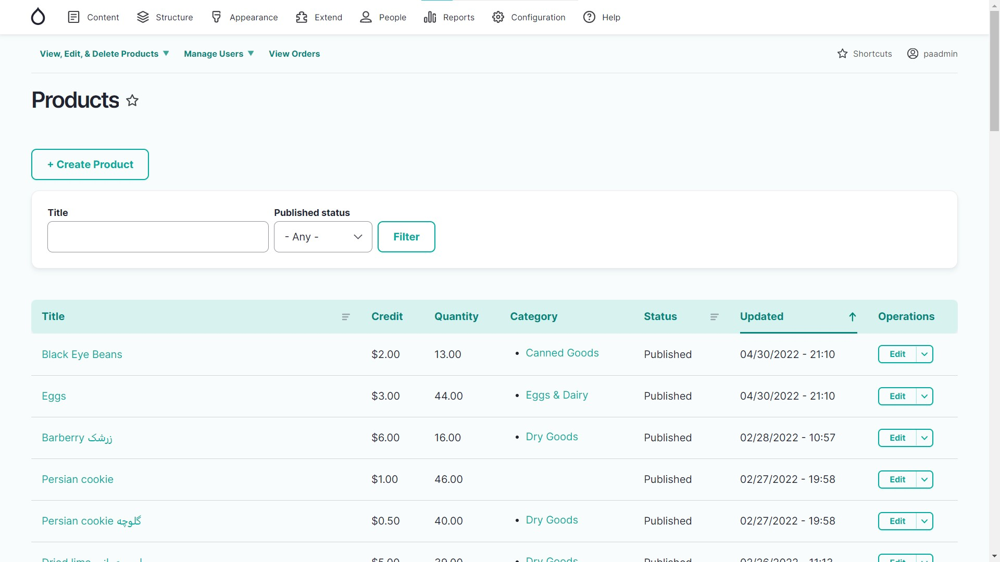
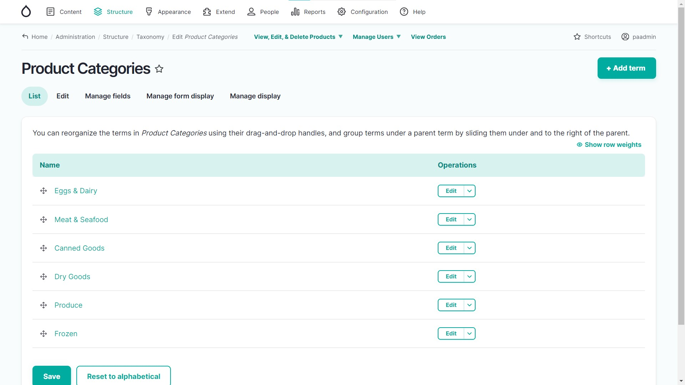
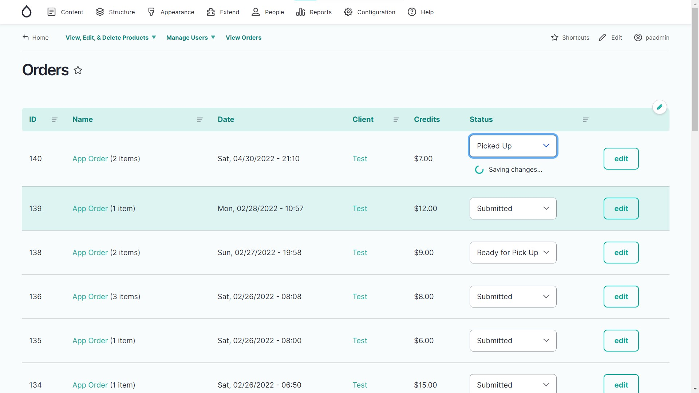
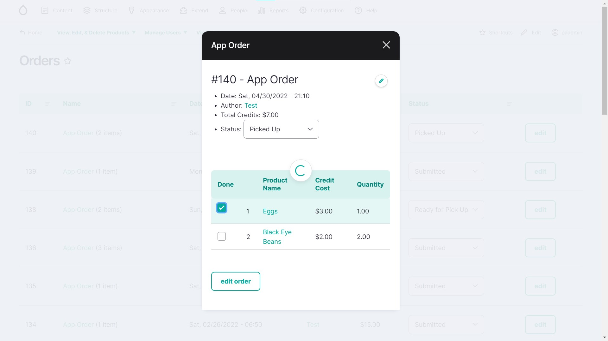
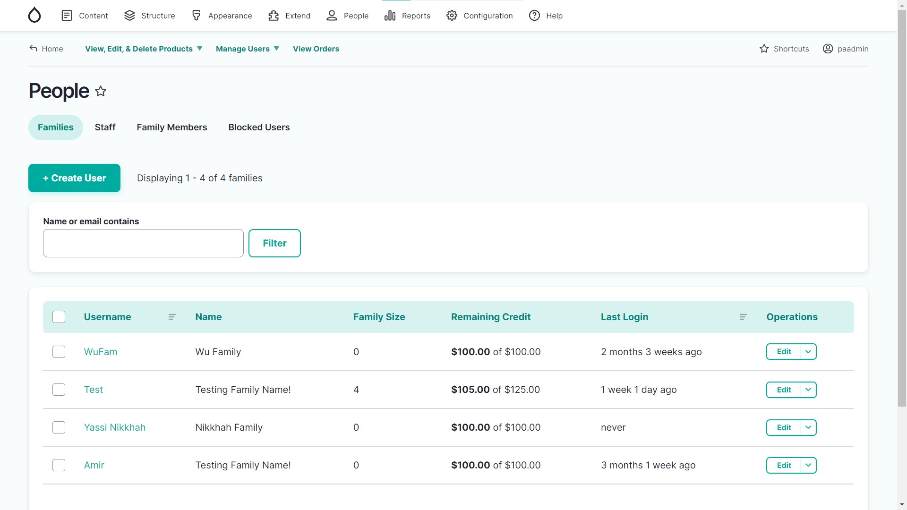
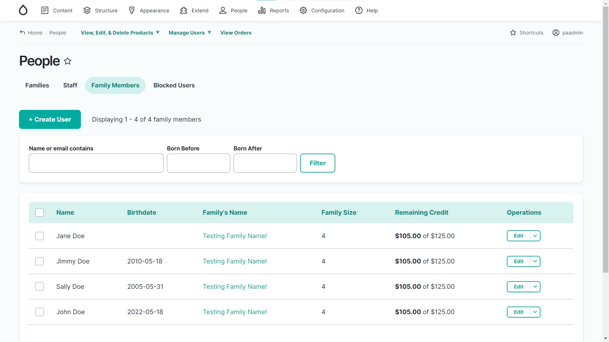

# Screenshots of the Backend

## Products Page

The home page of the website, displaying all of the products.

## Product Categories Page

The product categories of the home page.

## Orders Page

An overview of the all the orders. Allows staff to process orders using:
 - the select lists (which update the database using AJAX) or 
 - the dialog (opened by clicking the title) and check off each item one by one

### The Select Lists

### The Dialog

## People Page

An overview of all the users (aka families) of the website, with several tabs.

### Families

### Family Members

The House of Omeed wanted to know how many of their client's had children in school. Thus, we created this page.

